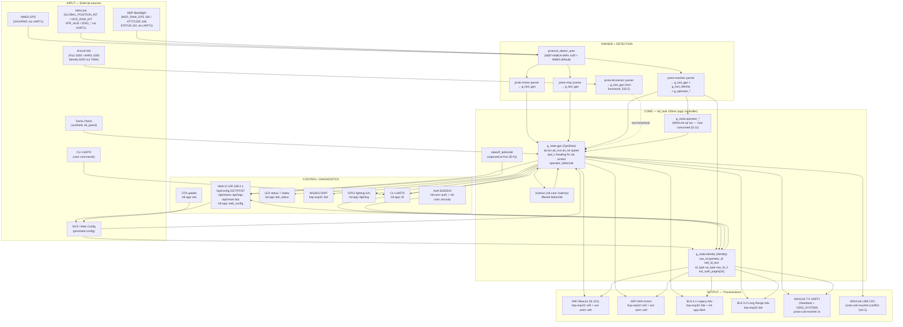

# OmniRID — Data Flow & Field Verification (Rust Firmware)

> **Rust firmware architecture** — `OmniRID/` workspace.
> Replaces legacy C firmware `ESP32_DRONE_REMOTE_ID_Firmware/` (deleted).
> Same Kalman filter, same TX chain, same parser→core→TX flow. File paths changed but architecture is equivalent.

Last updated: 2026-09-16 (audited against `OmniRID/firmware/`, `OmniRID/inputs/`, `OmniRID/outputs/` Rust sources).

> Session update (2026-09-16, CI green): the CI-only fixes of this session don't
> change dataflow verdicts — pkcs8 pinned back to 0.10 (2nd time, PR #37),
> `OmniRID-Desktop/package-lock.json` committed, unused `noble`/`pcap`
> optional deps dropped, `node-abi` overridden to 4.35.0 (Electron 44 ABI).
> Documented here so the doc dates match `softwarestatus.md`.

Method: static code audit. For every data item we trace the full chain **producer (parser) → core (`rid_task`) → consumer (TX / status / LED)** and mark it.

Verdict legend:
- ✅ **OK** — chain complete and correct
- 🔴 **BUG** — data produced but routed/lost incorrectly (functional defect)
- ⚫ **DEAD** — produced but never consumed (or consumed but never produced)
- 🟡 **RISK** — works but fragile / depends on external convention / precision loss
- ❗ **OPEN** — known defect or gap still present (see §10)

---

## Crate mapping (C → Rust)

| Legacy C file | Rust crate | Rust file(s) |
|---|---|---|
| `main/main.c` | `app` | `src/main.rs`, `src/controller.rs` |
| `esp_remote_id.c` | `app` + `rid-core` | `controller.rs`, `rid-core/src/hub.rs`, `rid-core/src/scheduler.rs` |
| `esp_remote_id.h` | `rid-interface` | `src/types.rs` |
| `protocol_detect.c` | `rid-core` | `src/protocol_detect.rs` |
| `nmea_parser.c` | `proto-nmea` | `inputs/proto-nmea/src/parser.rs` |
| `msp_parser.c` | `proto-msp` | `inputs/proto-msp/src/parser.rs` |
| `mavlink_parser.c` | `proto-mavlink` | `inputs/proto-mavlink/src/parser.rs` |
| `rid_dronecan.c` | `proto-dronecan` | `inputs/proto-dronecan/src/parser.rs` |
| `rid_patrol.c` | `rid-core` | `src/patrol.rs` |
| `wifi_tx.c` / `wifi.c` | `bsp-esp32` + `out-astm` | `bsp-esp32/src/wifi.rs`, `out-astm/src/wifi.rs` |
| `ble_tx.c` | `bsp-esp32` + `rid-app` | `bsp-esp32/src/ble.rs`, `rid-app/src/ble4.rs` |
| `rid_output.c/h` | `rid-core` + `out-astm` | `rid-core/src/hub.rs`, `out-astm/src/lib.rs` |
| `web_config.c` | `rid-app` + `bsp-esp32` | `rid-app/src/web_config.rs`, `bsp-esp32/src/web.rs` |
| `rid_ota.c` | `rid-app` + `bsp-esp32` | `rid-app/src/ota.rs`, `bsp-esp32/src/ota.rs` |
| `cli.c` | `rid-app` | `src/cli.rs` |
| `nvs_storage.c` | `rid-app` + `bsp-esp32` | `rid-app/src/nvs.rs`, `bsp-esp32/src/nvs.rs` |
| `rid_auth.c` | `rid-core` | `src/auth.rs` |
| `rid_security.c` | `rid-core` | `src/security.rs` |
| `rid_kalman.c` | `rid-core` | `src/kalman.rs` |
| `led_status.c` | `rid-app` | `src/led_status.rs` |
| `led_ws2812.c` | `bsp-esp32` + `rid-app` | `bsp-esp32/src/led.rs`, `rid-app/src/led_ws2812.rs` |
| `rid_lighting.c` | `rid-app` | `src/lighting.rs` |
| `rid_mavlink_tx.c` | `proto-usb-mavlink` | `inputs/proto-usb-mavlink/src/tx.rs` |
| `rid_mavlink_usb.c` | `proto-usb-mavlink` | `inputs/proto-usb-mavlink/src/lib.rs` |
| `opendroneid.c` + `mav2odid.c` | `opendroneid-sys` | `external-libs/opendroneid-sys/src/lib.rs` (FFI bindings) |

---

## 0) Quick answer — drone-to-drone sharing / forwarding

**There is NO active drone-to-drone sharing or connection-forwarding code.**

| Feature | Status | Where |
|---|---|---|
| Promiscuous WiFi RX / sniffer (ODID RX) | ❌ **Defined but NEVER called** (dead library code) | `out-astm/src/wifi.rs` (lib code) |
| BLE scanner RX | ❌ Absent (`esp_ble_gap_start_scanning` never used) | `bsp-esp32/src/ble.rs` is TX only |
| Mesh relay / ESP-NOW | ❌ Absent (only a roadmap TODO) | `softwarestatus.md` "ESP-NOW mesh relay" |
| MAVLink outbound forwarding to GCS | ⚠️ Only heartbeat + operator location TX | `inputs/proto-usb-mavlink/src/tx.rs` (UART1) |
| Re-broadcast of other drones' RID | ❌ Absent | — |

The RX parsers (`proto-mavlink`, `proto-msp`, `proto-nmea`, `proto-dronecan`) receive data ONLY from the flight controller over UART/CAN, consume it and re-transmit it as the RID **of the drone itself**. There is no mechanism that receives another drone's RID (WiFi or BLE) and forwards it.

---

## 1) Mega graph (Mermaid)

---

## 2) Field-by-field — `GpsData`

### 2.1 `latitude` / `longitude`
| Producer | Where | Consumer | Verdict |
|---|---|---|---|
| MSP `MSP_RAW_GPS` (deg1e7 → /1e7) | `inputs/proto-msp/src/parser.rs` | `g_state.gps` → WiFi `out-astm::wifi`, BLE `rid-app::ble4` | ✅ **FIXED** — MSP v1 framing, see §10.1 |
| NMEA `$GPGGA/$GPRMC` | `inputs/proto-nmea/src/parser.rs` | same | ✅ OK |
| MAVLink `GLOBAL_POSITION_INT` / `GPS_RAW_INT` / `ODID_LOCATION` | `inputs/proto-mavlink/src/parser.rs` | same | ✅ OK |
| MAVLink `OPEN_DRONE_ID_SYSTEM` | `inputs/proto-mavlink/src/parser.rs` | same | ✅ **FIXED (A)** — writes only operator fields, no longer touches `g_last_gps` |
| MAVLink `MESSAGE_PACK` submsg | `inputs/proto-mavlink/src/parser.rs` | same | ✅ OK |
| DroneCAN `Fix2` | `inputs/proto-dronecan/src/parser.rs` | same | ✅ **FIXED** — full multi-frame transfer reassembly (FT0/FT1) implemented (`TransferReceiver`) so `decode_fix2` is reachable (#19) |
| Demo patrol | `rid-core/src/patrol.rs` | same | ✅ OK |
| Kalman (float) | `rid-core/src/kalman.rs` | `g_state.gps` | 🟡 RISK — double→float loses ~0.5 m resolution; acceptable for RID |

### 2.2 `altitude_msl`
| Producer | Where | Consumer | Verdict |
|---|---|---|---|
| MSP (dm → /10) | `inputs/proto-msp/src/parser.rs` | WiFi `out-astm::wifi`, BLE `rid-app::ble4` | ✅ **FIXED** — MSP v1 framing, see §10.1 |
| NMEA `$GPGGA` | `inputs/proto-nmea/src/parser.rs` | same | ✅ OK |
| MAVLink (GPI / GPS_RAW_INT / VFR_HUD / ODID_LOC) | `inputs/proto-mavlink/src/parser.rs` | same | ✅ OK |
| DroneCAN `Fix2` (mm → /1000) | `inputs/proto-dronecan/src/parser.rs` | same | ✅ **FIXED** — reachable via reassembled transfer, scm/mm converted to m (#19) |
| Kalman | `rid-core/src/kalman.rs` | same | ✅ OK |

### 2.3 `altitude_relative` (→ ODID `Height`)
| Producer | Where | Consumer | Verdict |
|---|---|---|---|
| MAVLink (GPI / ODID_LOC / PACK) | `inputs/proto-mavlink/src/parser.rs` | WiFi `out-astm::wifi`, BLE `rid-app::ble4` | ✅ OK |
| DroneCAN `Fix2` (ellipsoid mm) | `inputs/proto-dronecan/src/parser.rs` | same | ❗ unreachable (§10.2); would be 🟡 RISK (ellipsoid ≠ height-above-takeoff) |
| Demo patrol | `rid-core/src/patrol.rs` | same | ✅ OK |
| MSP / NMEA | never set by parser | derived from takeoff in `app::controller` | ✅ **FIXED (J)** — ODID `Height` = height-above-takeoff for MSP/NMEA |
| Takeoff capture | `app::controller` | `/api/status` + MSP/NMEA `Height` | ✅ **FIXED (J)** — now consumed |

### 2.4 `altitude_baro`
| Producer | Where | Consumer | Verdict |
|---|---|---|---|
| MSP | `inputs/proto-msp/src/parser.rs` | `AltitudeBaro` `out-astm::wifi`, `rid-app::ble4` | ✅ fixed, see §10.1 |
| NMEA `$GPGGA` | `inputs/proto-nmea/src/parser.rs` | `AltitudeBaro` | ✅ **FIXED (K)** |
| MAVLink `ODID_LOCATION` | `inputs/proto-mavlink/src/parser.rs` | `AltitudeBaro` | ✅ **FIXED (K)** |
| DroneCAN | never set | — | — |

### 2.5 `speed`
| Producer | Where | Consumer | Verdict |
|---|---|---|---|
| MSP (cm/s → /100) | `inputs/proto-msp/src/parser.rs` | WiFi `out-astm::wifi`, BLE `rid-app::ble4` | ✅ fixed, see §10.1 |
| NMEA `$GPRMC/$GPVTG` (kt → ×0.5144) | `inputs/proto-nmea/src/parser.rs` | same | ✅ OK |
| MAVLink (GPI / GPS_RAW_INT / VFR_HUD / ODID_LOC) | `inputs/proto-mavlink/src/parser.rs` | same | ✅ OK |
| DroneCAN `Fix2` (cm/s → /100) | `inputs/proto-dronecan/src/parser.rs` | same | ❗ unreachable (§10.2) |
| Kalman (from filter v) | `rid-core/src/kalman.rs` | same | ✅ OK |

### 2.6 `speed_vertical`
| Producer | Where | Consumer | Verdict |
|---|---|---|---|
| MAVLink (GPI / ODID_LOC / PACK) | `inputs/proto-mavlink/src/parser.rs` | WiFi `out-astm::wifi`, BLE `rid-app::ble4` | ✅ OK |
| **MSP / NMEA** | scheduler derives from altitude deltas (Kalman off) | Kalman `climb` else derivative | ✅ **FIXED** — vertical speed filled for the two most common FC protocols (#34) |
| DroneCAN | never set | stays 0 | ❗ unreachable anyway |
| Kalman | `rid-core/src/kalman.rs` | same | ✅ OK |

### 2.7 `heading`
| Producer | Where | Consumer | Verdict |
|---|---|---|---|
| MSP (RAW_GPS cdeg→/10, ATTITUDE yaw/10) | `inputs/proto-msp/src/parser.rs` | WiFi `out-astm::wifi`, BLE `rid-app::ble4` | ✅ fixed, see §10.1 |
| NMEA `$GPVTG` | `inputs/proto-nmea/src/parser.rs` | same | ✅ OK |
| MAVLink (GPI cdeg / VFR_HUD / ATTITUDE / AHRS2 / ODID_LOC) | `inputs/proto-mavlink/src/parser.rs` | same | ✅ OK |
| DroneCAN `Fix2` (deg1e2 → /100) | `inputs/proto-dronecan/src/parser.rs` | same | ❗ unreachable (§10.2) |
| Kalman (atan2 of velocities) | `rid-core/src/kalman.rs` | same | ✅ OK |

### 2.8 `fix_type`
| Producer | Where | Gate that accepts it | Verdict |
|---|---|---|---|
| MSP (`MSP_RAW_GPS`) | `inputs/proto-msp/src/parser.rs` | `msp_parser_get` `fix>=2` | ✅ **FIXED (G)** — Betaflight/iNav 3D fix = 2; gate was `>=3` (never passed) |
| NMEA `$GPGGA` (fix≥2 → 3) | `inputs/proto-nmea/src/parser.rs` | `nmea_parser_get` `fix>=2` | ✅ OK |
| MAVLink (GPI hardcoded 3 / GPS_RAW_INT / ODID_LOC) | `inputs/proto-mavlink/src/parser.rs` | rid_task `fix>=2` | ✅ OK |
| DroneCAN `Fix2` (≥2) | `inputs/proto-dronecan/src/parser.rs` | rid_task `fix>=2` | ❗ unreachable (§10.2) |
| Demo patrol (2..4) | `rid-core/src/patrol.rs` | always | ✅ OK |

### 2.9 `satellites`
| Producer | Where | Consumer | Verdict |
|---|---|---|---|
| MSP / NMEA / MAV GPS_RAW_INT / DroneCAN | parsers | accuracy estimate `out-astm::wifi`, `rid-app::ble4`; status | ✅ OK |
| MAVLink `OPEN_DRONE_ID_SYSTEM` | `inputs/proto-mavlink/src/parser.rs` | — | ✅ **FIXED (K)** — `area_count` no longer misused as satellite count (removed) |

### 2.10 `armed`
| Producer | Where | Consumer | Verdict |
|---|---|---|---|
| MSP `MSP_STATUS` (flag bit0) | `inputs/proto-msp/src/parser.rs` → `gps_data.armed` | `FORCE_ARM_OK` gate, lighting | ✅ **FIXED (C)** — `g_state.gps.armed` no longer force-overwritten; MAVLink overwrite now inside `if (proto==MAVLINK)` |
| MAVLink `HEARTBEAT` | `inputs/proto-mavlink/src/parser.rs` → `g_state.mavlink_armed` | lighting, `gps.armed` | ✅ OK |
| Demo patrol (armed=true) | `rid-core/src/patrol.rs` | — | ✅ OK (survives, no overwrite) |

### 2.11 `operator_lat` / `operator_lon` / `operator_alt` (within `gps`)
| Producer | Where | Consumer | Verdict |
|---|---|---|---|
| Static config (fallback) | `app::controller` | ODID `System` `out-astm::wifi`, `rid-app::ble4` | ✅ OK |
| MAVLink op-loc → `g_state.operator_*` | `inputs/proto-mavlink/src/parser.rs` → state `app::controller` | copied into `g_state.gps.operator_*` | ✅ **FIXED (B)** — no longer write-only |
| DroneCAN `Identity` (8192) | — | — | ❗ **OPEN** — custom wire format not specified; stub never decoded (also unreachable for position anyway) |
| `OperatorAltitudeGeo` | — | — | ✅ **FIXED (K)** — now transmitted |

---

## 3) `Identity`

| Field | Producer | Consumer | Verdict |
|---|---|---|---|
| `uas_id` | config fallback / MAVLink `OPEN_DRONE_ID_BASIC_ID` / demo | WiFi `out-astm::wifi`, BLE `rid-app::ble4` | ✅ OK |
| `operator_id` | config / MAVLink `OPEN_DRONE_ID_OPERATOR_ID` / demo | WiFi `out-astm::wifi`, BLE `rid-app::ble4` | ✅ OK |
| `self_id_text` | config / MAVLink `OPEN_DRONE_ID_SELF_ID` / demo | WiFi `out-astm::wifi`, BLE `rid-app::ble4` | ✅ OK |
| `id_type`, `ua_type` | config / MAVLink `OPEN_DRONE_ID_BASIC_ID` | WiFi `out-astm::wifi`, BLE `rid-app::ble4` | ✅ OK |
| `uas_id_2`, `id_type_2`, `ua_type_2` | config **only** (never from MAVLink) | WiFi `out-astm::wifi`, BLE `rid-app::ble4` | ✅ OK (2nd BasicID enabled if `uas_id_2` non-empty) |
| `has_self_id`, `self_id_desc_type` | MAVLink `OPEN_DRONE_ID_SELF_ID` | TX | ✅ **FIXED** — DescType taken from identity when `has_self_id`, else `TEXT` |
| `ext_auth_pages[]`, `has_ext_auth`, `ext_auth_last_page` | MAVLink RX `OPEN_DRONE_ID_AUTHENTICATION` + MESSAGE_PACK | TX relay when pages 0..last all received | ✅ **FIXED (D)** — pages + `ext_auth_type`/`ext_auth_length` stored and re-broadcast; priority over local signing |
| Auth signing (`rid_auth_sign_identity`) | `rid-core/src/auth.rs` | WiFi `out-astm::wifi`, BLE `rid-app::ble4` (`AuthValid`/`Auth`) | ✅ **FIXED (D)** — correct wire format (page 0 = 17 B payload), capped to `ODID_PACK_MAX_MESSAGES` |
| `identity_ready` gate sanity | `identity_is_sane` | TX gate | ✅ OK (by design rejects `ESP32-RID-*` / `OP-UNKNOWN`) |

---

## 4) `State`

| Field | Writer | Reader | Verdict |
|---|---|---|---|
| `gps_valid` | set on GPS accept; cleared at 10 s absolute timeout | TX gate, LED, status | ✅ OK — timeout independent of Kalman (FIXED M) |
| `identity_ready` | gate logic / demo | TX gate | ✅ OK |
| `mavlink_armed` | MAVLink HEARTBEAT | `gps.armed` (MAVLink only), lighting | ✅ OK |
| `mavlink_sysid` (state) | `mavlink_parser_get_sysid` | `/api/status` | ✅ **FIXED** |
| `operator_lat/lon/alt` (state) | `inputs/proto-mavlink/src/parser.rs` | copied to `g_state.gps.operator_*` → TX `System` | ✅ **FIXED (B)** |
| `operator_position_updated_ms`, `operator_location_type` | MAVLink SYSTEM | status/CLI | ✅ **FIXED (B)** — written with the op-loc |
| `auth_enabled` (state) | `rid_auth_enabled()` in `esp_rid_init` | `/api/status` | ✅ **FIXED** |
| `takeoff_lat/lon/alt`, `takeoff_captured` | first 3D fix `app::controller` | `/api/status` + MSP/NMEA `Height` | ✅ **FIXED (J)** — no longer underused |
| `transmissions_count`, `wifi_bcn_count`, `wifi_nan_count`, `ble4_count`, `ble5_count` | `update_transmissions()` | `/api/status` | ✅ OK |
| `last_update_ms` | on GPS accept | 10 s timeout | ✅ OK |
| `active_protocol` | rid_task detect/fallback/demo | TX gate, `/api/status`, CLI | ✅ OK |

---

## 5) `Config` — full inventory, NVS persistence, honored?

Sources: `default_config()` (`rid-app/src/config.rs`), persisted in NVS namespace `"esp_rid"` (`rid-app/src/nvs.rs`), edited via Web `POST /api/config` and CLI `rid-app/src/cli.rs`.

> Update (2026-08-28): all rows previously marked `❌ NOT persisted` were addressed by [#25] (get_blob/set_blob for the full config); see §10.7–10.8.

| Field | Type / Default | NVS | Honored / Consumers |
|---|---|---|---|
| `protocol` | enum `AUTO` | ✅ now persisted (#25) | dispatch in rid_task; resets to AUTO each boot |
| `uart_port` | u8 1 | ✅ now persisted (#25) | UART config (`protocol_detect_init/reinit`) |
| `baud_rate` | u32 57600 | ✅ | UART reinit; boot baud = 115200 in AUTO, else configured (FIXED H) |
| `tx_pin` | u8 17 | ✅ now persisted (#25) | UART config |
| `rx_pin` | u8 18 | ✅ now persisted (#25) | UART config |
| `ua_type` | u8 1 | ✅ | BasicID UAType |
| `id_type` | u8 1 | ✅ | BasicID IDType |
| `uas_id` | str[21] `"ESP32-RID-001"` | ✅ | BasicID + identity fallback; boot MAC fix |
| `operator_id` | str[21] `"OP-UNKNOWN"` | ✅ | OperatorID + fallback; boot MAC fix |
| `self_id_text` | str[21] `""` | ✅ | SelfID + fallback |
| `operator_lat/lon/alt` | f64/f64/f32 0 | ✅ as **float** | `g_state.gps.operator_*`; demo — 🟡 RISK (float NVS loses precision vs f64 default) |
| `ua_type_2` | u8 0 | ✅ | BasicID[1] |
| `id_type_2` | u8 0 | ✅ | BasicID[1] |
| `uas_id_2` | str[21] `""` | ✅ | BasicID[1] (enabled if non-empty) |
| `tx_modes` | u8 bitmask `WIFI_BCN` | ✅ | `update_transmissions()` |
| `wifi_channel` | u8 6 | ✅ | AP + beacon |
| `wifi_power_dbm` | f32 20.0 | ✅ | `esp_wifi_set_max_tx_power` |
| `wifi_bcn_rate_hz` | f32 1.0 | ✅ | `rate_allowed` beacon |
| `wifi_nan_rate_hz` | f32 0.0 | ✅ | `rate_allowed` NAN |
| `ble4_rate_hz` | f32 1.0 | ✅ | `rate_allowed` BLE4 |
| `ble4_power_dbm` | f32 18.0 | ✅ | `ble_tx_set_power` |
| `ble5_rate_hz` | f32 1.0 | ✅ | `rate_allowed` BLE5 |
| `ble5_power_dbm` | f32 18.0 | ✅ | `ble_tx_set_power` |
| `wifi_ssid` | str[21] `"ESP-RID"` | ✅ | AP SSID — 🟡 RISK: NVS cap 20 B vs spec 32 |
| `wifi_password` | str[21] `""` | ✅ | AP auth — 🟡 RISK: NVS cap 20 B vs spec 63 |
| `webserver_en` | u8 1 | ✅ | `web_config_init(bool)` (FIXED I) |
| `mavlink_sysid` | u8 0 (=any) | ✅ | sysid filter |
| `bcast_powerup` | u8 1 | ✅ | ✅ **FIXED** — `update_transmissions()` runs every tick; `bcast_powerup` gate broadcasts without GPS (#21) |
| `options` | u16 0 | ✅ | see §6 |
| `lock_level` | i8 0 | ✅ | `get_lock_level()`; ≥2 burns eFuse |
| `led_r/g/b_gpio` | i8 −1 | ✅ | RGB status LED |
| `ws2812_gpio` | i8 −1 | ✅ now persisted (#25) | WS2812 (RMT) |
| `ws2812_brightness` | u8 16 | ✅ now persisted (#25) | RMT brightness |
| `lighting_pins[5]` | i8[5] −1 | ✅ now persisted (#25) | GPIO outputs |
| `lighting_patterns[5]` | u8[5] 0 | ✅ now persisted (#25) | pattern selector |
| `lighting_phase_offsets[5]` | i16[5] 0 | ✅ now persisted (#25) | phase shift ms |
| `dronecan_rx_gpio` | i8 −1 | ✅ now persisted (#25) | TWAI RX |
| `dronecan_tx_gpio` | i8 −1 | ✅ now persisted (#25) | TWAI TX |
| `dronecan_bitrate` | u32 1000000 | ✅ now persisted (#25) | TWAI bitrate |
| `mavlink_usb_enable` | bool false | ✅ now persisted (#25) | USB MAVLink out (also §10.3 conflict) |
| `ota_trigger_gpio` | i8 −1 | ✅ now persisted (#25) | boot-time OTA trigger |
| `auth_private_key` | str[512] `""` | ✅ now persisted (#25) | Ed25519 signing — key must be re-entered each boot (§10.8) |
| `start_delay_ms` | u32 10000 | ✅ now persisted (#25) | startup delay |
| `public_keys[5]` | str[5][257] `""` | ✅ | Ed25519 verify (lock≥1); **survives factory reset** (FIXED O) |

**Boot ID fix-up** (`app/src/controller.rs`): if `uas_id=="ESP32-RID-001"` or `operator_id=="OP-UNKNOWN"`, both are regenerated from the eFuse MAC suffix and re-saved to NVS.

---

## 6) `options` and `tx_modes` matrices

### 6.1 `options` bitfield (`rid-interface/src/types.rs`)

| Bit | Flag | Effect |
|---|---|---|
| 0 | `RID_OPT_FORCE_ARM_OK` | GPS gate bypassed when `armed==true` |
| 1 | `RID_OPT_DONT_SAVE_BASIC_ID` | clears `uas_id`/`uas_id_2` after identity assembly → empty BasicID |
| 2 | `RID_OPT_PRINT_RID_MAVLINK` | logs RID summary line each loop |
| 3 | `RID_OPT_DEMO_MODE` | synthetic patrol when no GPS; LED DEMO; Kalman auto-off |
| 4 | `RID_OPT_KALMAN_FILTER` | 3×1D Kalman on lat/lon/alt, overwrites `g_state.gps` |
| 5 | `RID_OPT_AUTH_ED25519` | `rid_auth_init(privkey)` → ODID Auth message |
| 6 | `RID_OPT_MAVLINK_ARM_STATUS` | enables MAVLink TX task (heartbeat, armed) |
| 7 | `RID_OPT_MAVLINK_OP_LOC_LOOP` | enables MAVLink TX operator-location loop |
| 8 | `RID_OPT_IDENTITY_READY_GATE` | TX blocked until identity sane + position sane |

`sane()` rules: `uas_id` non-empty && ≠ `ESP32-RID-*`; `operator_id` non-empty && ≠ `OP-UNKNOWN`; lat ∈ [−90,90], lon ∈ [−180,180].

### 6.2 `tx_modes` bitfield (`rid-interface/src/types.rs`)

| Bit | Flag | Builder | Rate source | Counters |
|---|---|---|---|---|
| 0 | `RID_TRANSMIT_WIFI_BCN` | `wifi_tx_transmit` | `wifi_bcn_rate_hz` | `wifi_bcn_count`, `transmissions_count` |
| 1 | `RID_TRANSMIT_WIFI_NAN` | `wifi_tx_transmit_nan` | `wifi_nan_rate_hz` | `wifi_nan_count`, `transmissions_count` |
| 2 | `RID_TRANSMIT_BLE4` | `ble_tx_transmit_legacy` | `ble4_rate_hz` | `ble4_count`, `transmissions_count` |
| 3 | `RID_TRANSMIT_BLE5` | `ble_tx_transmit_lr` | `ble5_rate_hz` | `ble5_count`, `transmissions_count` |

Global gate (`update_transmissions()` `app/src/controller.rs`): needs `gps_valid || bcast_powerup` (but is only reached when `had_gps` — see §10.5), `active_protocol != UNKNOWN`, and identity gate if option set. Beacon TX uses 4-attempt fallback `{AP,STA,AP,STA} × {no-seq,no-seq,seq,seq}`.

---

## 7) TX chain (ODID message map)

| ODID Message | WiFi Beacon | WiFi NAN | BLE4 | BLE5 | MAVLink TX |
|---|---|---|---|---|---|
| BasicID (0) | ✅ | ✅ | ✅ | ✅ | — |
| Location (1) | ✅ | ✅ | ✅ | ✅ | — |
| System (4) | ✅ | ✅ | ✅ | ✅ | ✅ (`proto-usb-mavlink::tx`) |
| SelfID (3) | ✅ | ✅ | ✅ | ✅ | — |
| OperatorID (5) | ✅ | ✅ | ✅ | ✅ | — |
| Auth (2) | ⚠️ from `ext_auth_pages` or local Ed25519, if `AUTH_ED25519` | — | — | — | — |

| Path | Pack / result | Verdict |
|---|---|---|
| WiFi Beacon | `odid_wifi_build_message_pack_beacon_frame` via `esp_wifi_80211_tx` 4-attempt fallback | ✅ OK |
| WiFi NAN | `odid_wifi_build_message_pack_nan_action_frame` | ✅ OK |
| BLE 4.x legacy | exactly one 25 B message per 31 B ADV (Service Data 0xFFFA + app code 0x0D + counter), rotated across cycles | ✅ **FIXED (F)** |
| BLE 5.0 LR | ext adv instances, full pack, 254 B OK | ✅ OK on S3 (compiled only when `CONFIG_BT_BLE_50_EXTEND_ADV_EN`); ⚠️ C6: `caps.rs` says `ble:true, ble5:true` but the BLE binding is a no-op **at runtime/CI** (see `softwarestatus.md` P0) |
| MAVLink TX (UART1) | heartbeat 1 s + `OPEN_DRONE_ID_SYSTEM` 6 s, built from real operator/state | ✅ **FIXED (E)** |
| MAVLink USB | mirrors heartbeat + SYSTEM to USB UART | ✅ **FIXED** — but ❗ §10.3 UART0 console conflict |
| ODID `Auth` | `AuthValid`/`Auth` pages from Ed25519 signing | ✅ **FIXED (D)** |

---

## 8) Timeouts / rate constants

| Constant | Value | Where |
|---|---|---|
| MAVLink parser GPS freshness | 5 s | `inputs/proto-mavlink/src/parser.rs` |
| MAVLink identity freshness | 10 s | `inputs/proto-mavlink/src/parser.rs` |
| Operator loc freshness | 30 s | `inputs/proto-mavlink/src/parser.rs` |
| GPS validity timeout | 10 s (absolute, on `last_update_ms`) | `app::controller` |
| Kalman timeout | 3 s (`RID_KALMAN_TIMEOUT_US`) | `rid-core/src/kalman.rs` |
| Web rate limit | 10 fails / 60 s (config POST + factory reset only, not `/api/command`) | `rid-app/src/web_config.rs` |
| Startup delay default | 10 s | `app::controller` |
| Loop period | 100 ms | `app::controller` |
| Detect read window / timeout | 50 ms / 1 s | `rid-core/src/protocol_detect.rs` |
| OTA idle abort | `OTA_MAX_IDLE_STALLS=12` (~60 s) | `rid-app/src/ota.rs` |

---

## 9) Fix campaign status (A–P)

| # | Severity | Issue | Location | Status |
|---|---|---|---|---|
| A | HIGH | `OPEN_DRONE_ID_SYSTEM` copied operator position into drone position (TX sent operator coords) | `inputs/proto-mavlink/src/parser.rs` | ✅ **FIXED** — now writes only operator fields |
| B | HIGH | MAVLink operator location written to write-only `g_state.operator_*`; TX always used static config | `app::controller` | ✅ **FIXED** — copied to `g_state.gps.operator_*` |
| C | HIGH | `armed` always overwritten to false for non-MAVLink protocols | `app::controller` | ✅ **FIXED** (overwrite moved inside `if (proto==MAVLINK)`) |
| D | HIGH | Ed25519 auth configured but never transmitted; MAVLink-relayed auth pages never re-broadcast | `rid-core/src/auth.rs`, `out-astm::wifi`, `rid-app::ble4` | ✅ **FIXED** — self-signing wired + relay pages re-broadcast |
| E | HIGH | MAVLink TX sent hardcoded zero/−1000 SYSTEM payload, never real state | `inputs/proto-usb-mavlink/src/tx.rs` | ✅ **FIXED** — built from `mavlink_parser_get_operator_location` |
| F | HIGH | BLE 4.x legacy adv broken (whole pack > 31 B, no rotation) | `bsp-esp32/src/ble.rs` + `rid-app/src/ble4.rs` | ✅ **FIXED** — 31 B ADV, one rotated message + counter |
| G | HIGH | MSP gate `fix>=3` never passes on Betaflight/iNav (max 2) → MSP dead in practice | `inputs/proto-msp/src/parser.rs` | ✅ **FIXED** — gate `>=2` + MSP v1 framing (§10.1) |
| H | MED | Boot ignored configured `baud_rate` (AUTO probed hardcoded 115200) | `rid-core/src/protocol_detect.rs`, `app::controller` | ✅ **FIXED** — boot baud = 115200 in AUTO, else configured |
| I | MED | `uart_port`/`tx_pin`/`rx_pin`/`webserver_en` dead fields | `rid-core/src/protocol_detect.rs`, `rid-app/src/web_config.rs` | ✅ **FIXED** — UART config + `web_config_init(bool)` |
| J | MED | NMEA/MSP never set `altitude_relative` → ODID `Height=0` | parsers | ✅ **FIXED** — derived from takeoff |
| K | LOW | `takeoff_*` underused; `AltitudeBaro`/`OperatorAltitudeGeo` never TX; `area_count` misused as satellites; state `mavlink_sysid`/`auth_enabled` never written | various | ✅ **FIXED** |
| L | LOW | DroneCAN `Identity`(8192)/`AHRS`(1000) stubs never decoded | `inputs/proto-dronecan/src/parser.rs` | 🟡 **BACKLOG** — custom wire format unspecified (separate from #19; Fix2 reassembly now works) |
| M | MED | GPS validity never expired while Kalman predicted (stale positions forever) | `app::controller` | ✅ **FIXED** — absolute 10 s timeout |
| N | MED | OTA upload loop could spin forever on stalled client | `rid-app/src/ota.rs` | ✅ **FIXED** — idle abort ~60 s |
| O | MED | Factory reset wiped provisioned public keys | `rid-app/src/nvs.rs` | ✅ **FIXED** — `nvs_storage_reset_preserve_keys()` preserves pubkey1..5 |
| P | LOW | CLI could read config but not write it | `rid-app/src/cli.rs` | ✅ **FIXED** — `config set <field> <value>` |

---

## 10) Open issues & risks (current audit, 2026-09-16)

1. ✅ **FIXED [#18] MSP framing off-by-one** — `proto-msp` now uses standard MSP v1 framing (`buf[3]=size, buf[4]=type, payload=buf[5..]`); the replicated C quirk (size at `buf[4]`) was removed. Unblocks all MSP rows in §2.
2. ✅ **FIXED [#19] DroneCAN effectively non-functional** — `inputs/proto-dronecan/src/parser.rs` implements full multi-frame (FT0/FT1) transfer reassembly via `TransferReceiver` (TID/toggle/timeout/CRC), so the `if (len < 32)` guard no longer truncates, and `decode_fix2` is reachable and covered by a passing test (AHRS/Identity wire-format stubs remain a separate backlog item, not part of #19).
3. 🟡 **OPEN [#22] MAVLink USB vs console** — the Rust port maps MAVLink USB to the USB-Serial/JTAG peripheral (`hardware/bsp-esp32/src/usb.rs`), not UART0 as in the C code, so the original UART0 clash is architecturally gone. On C3/C6 the USB-Serial/JTAG may also carry console output — **verify at runtime/CI** (hardware-only; no host repro).
4. ✅ **FIXED [#20] Web `/ota` has no signature check at lock=1** — `firmware/rid-app/src/ota.rs` requires a valid `X-Signature` (Ed25519) for uploads at `lock_level >= 1` and rejects unconditionally at `lock_level >= 2` (tests `lock_level_1_valid_signature_passes`, `lock_level_1_invalid_signature_rejected`).
5. ✅ **FIXED [#21] `bcast_powerup` effectively dead** — `update_transmissions()` now runs unconditionally every tick (`firmware/rid-core/src/scheduler.rs`, commit `21825c4`); `bcast_powerup` broadcasts without GPS. Test `bcast_powerup_transmits_without_gps`.
6. ✅ **FIXED [#34] `speed_vertical` never set for MSP/NMEA** — with the Kalman filter off (default), the scheduler derives it by differentiating the altitude delta (no GPS timer rollover issue). Tests `msp_nmea_derive_speed_vertical_without_kalman`, `kalman_supplies_climb_instead_of_differentiation`.
7. ✅ **FIXED [#25] NVS persistence gaps** — `protocol`, `uart_port`, `tx_pin`, `rx_pin`, `ws2812_*`, `lighting_*`, `dronecan_*`, `mavlink_usb_enable`, `ota_trigger_gpio`, `auth_private_key`, `start_delay_ms` are now saved via get_blob/set_blob; settings survive reboot (§5).
8. ✅ **FIXED [#25] Auth private key not persisted** — `auth_private_key` is now stored in NVS with managed lifecycle; signing no longer silently resets on boot.
9. ❗ **RMC truncated-sentence NULL deref risk** — `parse_rmc` accesses `fields[6]` without checking `field_count`; a malformed `$GPRMC` can crash the parser (now in Rust, bounds-checked — safe but may return error).
10. 🟡 **Kalman writes `g_state.gps` unlocked** — filter update runs while TX builders read the same struct unlocked (data race window).
11. 🟡 **Web rate limit covers only config POST + factory reset**, not `/api/command` (restart/factory can be hammered, though auth-gated at lock≥1).
12. 🟡 **Auth sign/verify asymmetry** — self-signing uses pure Ed25519 while verification uses SHA-256-ph pre-hash; signatures produced in some modes may not validate under the other convention. Verify against intended client.
13. 🟡 **NVS `wifi_ssid`/`wifi_password` capped at 20 B** — truncated vs SSID (32 B) / WPA2 (63 B) spec; AP falls back to open network if password truncates.
14. 🟡 **`operator_lat/lon` stored as float in NVS** — precision ~1e-7 deg; fine for RID, not for survey.

---

## Cross-reference

- `todolist/processes.md` — every runtime process, task, ISR and gates (companion doc; same findings §10).
- `todolist/softwarestatus.md` — open todos and recent completions.
